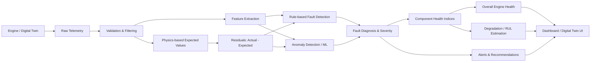
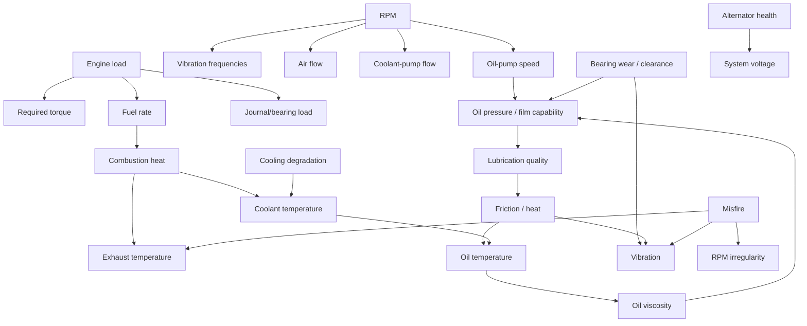
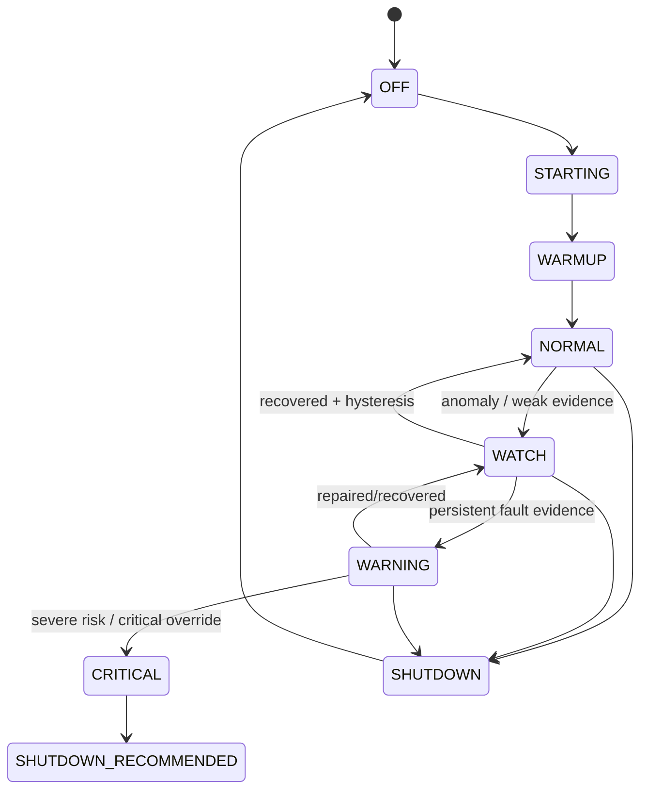
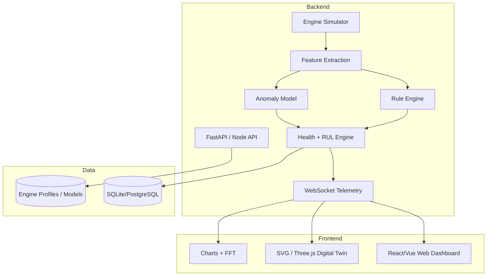

> **Status of this document (added 2026-09-28):** This is the original technical-research draft for IgniSense (Team Revora). It is the *base model*. Where it conflicts with [research-review-and-build-plan.md](research-review-and-build-plan.md), **the review wins**. Known superseded items: coolant fraction 0.18 and UA 500 W/K (§9, §34), brake-efficiency heat model (§8.3), oil-pressure formula (§10.2, Appendix A), flat 180 N·m torque (§2.1, §34), separate 2× and firing vibration terms (§11.3), Isolation Forest (§24), FastAPI/Python backend, database and Recharts (§36, §48), fleet page (§51). Everything else (thermostat, oil-temperature balance, alternator, sensor model, risk functions, health weights, fault scores, hysteresis, alert classes, lifecycle states) remains valid and fills gaps in the review.

---

# Smart Engine Health Monitoring System
## Technical Research, Digital-Twin Model, Calculations, Diagnostics, Predictive Maintenance, and High-Level System Design

**Project type:** Mechanical Engineering + Digital Twin + Condition Monitoring + Predictive Maintenance  
**Reference engine for the prototype:** Generic 4-cylinder, 4-stroke internal-combustion engine (configurable for petrol/gasoline or diesel)  
**Purpose:** A technically defensible blueprint for a software-first engine-health monitoring system that can operate from simulated telemetry today and real sensors later.

> **Important engineering note**  
> This document deliberately separates **physical laws**, **engineering approximations**, and **demo calibration values**. Exact temperature, oil-pressure, vibration, voltage, air-fuel and fault limits are engine-specific. A production system must use the engine manufacturer's limits, validated sensor placement, experimental baseline data, and appropriate standards. The numerical ranges in this document are intended for a configurable prototype, not for real-world safety decisions.

---

# 1. Executive Summary

A Smart Engine Health Monitoring System should do considerably more than display engine sensor values. A strong system should answer five progressively harder questions:

1. **Monitoring — What is happening now?**  
   Measure or simulate RPM, load, coolant temperature, oil temperature, oil pressure, vibration, electrical-system voltage, intake/exhaust variables, and other relevant signals.

2. **Detection — Is anything abnormal?**  
   Compare the current state with expected behaviour for the same operating condition. A temperature of 105 °C may be reasonable under high load but suspicious at idle; therefore context matters.

3. **Diagnosis — What is probably causing the abnormal behaviour?**  
   Combine multiple symptoms. Low oil pressure + rising oil temperature + increasing vibration is more informative than any one signal alone.

4. **Prognosis — How is the fault developing and when might a limit be crossed?**  
   Estimate degradation trends and Remaining Useful Life (RUL), with explicit uncertainty.

5. **Decision support — What should the operator do?**  
   Produce a severity level, evidence, probable causes, recommended inspection/maintenance action, and an explanation of why the system reached that conclusion.

The supplied project brief already frames the problem around a **Digital Twin**, **predictive maintenance**, **AI diagnostics**, real-time monitoring, visualization, analytics and alerts. This document expands that concept into a complete engineering model.

A high-level version of the project should therefore behave like a **virtual engine test bench**:

- The user starts a virtual engine.
- RPM and load can be changed.
- Sensor values change because of modeled physical relationships, not independent random numbers.
- The engine warms up dynamically.
- Oil pressure reacts to RPM, temperature, pump health and bearing clearance.
- Vibration contains rotational and firing-frequency components.
- Faults can be injected progressively: coolant failure, lubrication failure, bearing wear, misfire, alternator fault, sensor fault, etc.
- The Digital Twin predicts what each signal *should* be.
- The analytics layer calculates residuals, trends, RMS values, FFT features, anomaly scores and fault scores.
- The diagnosis layer explains likely causes.
- The health layer produces component health indices and an overall engine-health score.
- The prognostics layer estimates degradation and RUL when sufficient trend evidence exists.
- The dashboard visualizes the entire chain.

---

# 2. Scope and Design Assumptions

## 2.1 Reference engine

For a coherent simulation, choose one configurable reference profile rather than mixing unrelated engine types. A suitable hackathon profile is:

- 4-cylinder inline engine
- 4-stroke cycle
- 2.0 L displacement (example only)
- Idle target: approximately 800 rpm
- Maximum simulated speed: 6,000 rpm
- Peak torque parameter: configurable, e.g. 180 N·m
- Liquid cooling
- Pressure-fed lubrication
- 12 V electrical system with alternator charging
- Spark-ignition gasoline mode as the default; diesel can be another profile

All values should live in an `engine_profile` configuration so the same application can represent a generator engine, diesel engine, motorcycle engine, etc.

## 2.2 What the digital twin is — and is not

A hackathon Digital Twin does **not** need to reproduce combustion CFD, finite-element stresses, detailed journal-bearing hydrodynamics and ECU maps. That would require far more data and computation.

A defensible prototype uses a **reduced-order, lumped-parameter model**:

- Newtonian rotational dynamics for crank speed
- simplified engine torque and friction maps
- first-order/lumped thermal energy balances
- simplified pressure-flow relations for lubrication
- synthetic vibration signals tied to rotational and firing frequencies
- electrical charging-state equations
- stochastic sensor models
- fault severity states that modify physical parameters

The key requirement is **causal consistency**. When load rises, heat generation should rise. When oil becomes hotter, its effective viscosity should fall. When a bearing fault progresses, vibration should increase and the lubrication state may deteriorate. The simulation does not need perfect absolute accuracy to demonstrate correct engineering structure.

---

# 3. Overall System Flow



The important distinction is that the dashboard is the **last layer**, not the intelligence itself.

---

# 4. Engine State, Inputs, Measurements, and Derived Features

A useful mathematical representation is:

\[
\mathbf{x}(t)=
[N,\omega,T_c,T_o,P_o,V_b,\lambda,T_{exh},H_b,H_c,H_l,H_e,\ldots]
\]

where the state may contain:

- \(N\): engine speed [rpm]
- \(\omega\): angular speed [rad/s]
- \(T_c\): coolant temperature [°C]
- \(T_o\): oil temperature [°C]
- \(P_o\): oil pressure [bar or kPa]
- \(V_b\): battery/charging voltage [V]
- \(\lambda\): normalized air-fuel ratio, where appropriate
- \(T_{exh}\): exhaust-gas temperature [°C]
- \(H_b\): bearing-health state
- \(H_c\): cooling-system health
- \(H_l\): lubrication-system health
- \(H_e\): electrical-system health

User/environment inputs can be represented as:

\[
\mathbf{u}(t)=[u_{throttle},L,T_{amb},v_{air},F_{fan},F_{fault1},F_{fault2},\ldots]
\]

where \(L\) is normalized engine load and the fault variables are continuous severities between 0 and 1.

---

# 5. Parameters That Should Be Monitored

## 5.1 Core parameters for the hackathon version

| Parameter | Typical source in real system | Why it matters | Important derived features |
|---|---|---|---|
| Engine RPM | Crankshaft position/speed sensor | Operating point, overspeed, misfire signatures | angular velocity, speed variance, dRPM/dt, 1× frequency |
| Engine load / torque demand | ECU / torque estimate / dynamometer | Determines expected heat, fueling and stress | normalized load, load transients |
| Coolant temperature | ECT sensor | Cooling-system and thermal health | dT/dt, thermal residual, overheat duration |
| Oil temperature | Oil-temperature sensor | Lubricant viscosity and thermal stress | viscosity estimate, dT/dt |
| Oil pressure | Pressure transducer | Pump/lubrication/bearing-clearance health | pressure normalized by RPM and oil temperature |
| Vibration | Accelerometer | Bearing, imbalance, misfire and mechanical abnormality | RMS, peak, crest factor, kurtosis, FFT peaks |
| Battery/charging voltage | Voltage sensor / ECU | Alternator/regulator/electrical health | voltage ripple, under/over-voltage |
| Engine runtime | ECU/software | Maintenance exposure | total hours, hours under high load/temp |

## 5.2 Strong second-tier parameters

| Parameter | Value to the system |
|---|---|
| Manifold absolute pressure (MAP) | Estimate engine breathing/load; detect intake restrictions/leaks |
| Intake-air temperature (IAT) | Correct air density; explain hot ambient/intake conditions |
| Mass-air flow (MAF), if available | Airflow/load/combustion calculations |
| Lambda / oxygen sensor | Mixture quality and combustion diagnosis in engines where appropriate |
| Exhaust-gas temperature (EGT) | Thermal loading, combustion and fueling faults |
| Coolant level | Direct evidence for coolant-loss fault |
| Oil level | Helps distinguish oil starvation/leak from pump/clearance faults |
| Fuel-rate estimate | Efficiency and thermal input calculation |
| Acoustic signal | Knock/misfire/mechanical sound features if a microphone is available |
| Ambient temperature | Required to interpret cooling performance |
| Vehicle/shaft speed | Helps distinguish engine vibration from road/load conditions |

## 5.3 Advanced optional parameters

- Cylinder pressure or virtual cylinder-pressure estimate
- Individual-cylinder contribution/torque estimate
- Exhaust oxygen per bank
- Knock intensity
- crankcase pressure/blow-by
- coolant pressure
- oil differential pressure across filter
- alternator current
- battery current and state of charge
- turbo boost and turbo speed for turbocharged engines
- NOx/particulate/emissions-related signals for advanced diesel use cases

---

# 6. Parameters Must Affect One Another

The project becomes technically convincing when signals form a causal network.



## 6.1 Directional relationship table

Legend: ↑ means generally increases; ↓ means generally decreases; `context` means operating-condition dependent.

| Change | Expected consequence |
|---|---|
| RPM ↑ | rotational frequency ↑; firing frequency ↑; oil-pump flow/pressure tendency ↑ until relief; coolant-pump flow often ↑ for mechanical pumps; vibration frequencies shift upward |
| Load ↑ | required torque ↑; fuel rate ↑; cylinder pressure/thermal input ↑; coolant and exhaust temperatures tend to ↑; bearing load ↑ |
| Ambient temperature ↑ | radiator temperature difference ↓; cooling margin ↓; coolant/oil temperatures tend to ↑ |
| Coolant flow ↓ | coolant temperature ↑ and thermal residual ↑ |
| Radiator/fan effectiveness ↓ | coolant temperature ↑ especially at low airflow/high load |
| Oil temperature ↑ | lubricant viscosity generally ↓; pressure tendency may ↓; oil-film margin can reduce if excessive |
| Oil-pump health ↓ | pressure and flow ↓ |
| Bearing clearance/wear ↑ | leakage through clearances ↑; oil pressure may ↓; mechanical vibration/noise may ↑ |
| Misfire severity ↑ | instantaneous crank-speed irregularity ↑; vibration/torque pulsation ↑; power contribution ↓ |
| Alternator health ↓ | charging voltage/current capability ↓ |
| Sensor bias/drift ↑ | disagreement between predicted and measured values ↑ without corresponding multi-sensor physics |

These relationships are not all linear; many depend on speed, load, temperature and control systems.

---

# 7. Fundamental Mechanical Calculations

## 7.1 RPM to angular velocity

\[
\omega=\frac{2\pi N}{60}
\]

where:

- \(N\) = rpm
- \(\omega\) = rad/s

At 3000 rpm:

\[
\omega=\frac{2\pi(3000)}{60}=314.16\text{ rad/s}
\]

## 7.2 Shaft power from torque

\[
P_b=T\omega
\]

At \(T=80\text{ N·m}\) and 3000 rpm:

\[
P_b=80\times314.16=25.13\text{ kW}
\]

This is useful because load, fuel use and heat generation should be connected through required shaft power rather than being unrelated random variables.

## 7.3 Brake Mean Effective Pressure (BMEP)

For a four-stroke engine:

\[
BMEP=\frac{4\pi T}{V_d}
\]

For an example 2.0 L engine, \(V_d=0.002\text{ m}^3\), producing 80 N·m:

\[
BMEP=\frac{4\pi(80)}{0.002}=502655\text{ Pa}\approx5.03\text{ bar}
\]

BMEP is a useful load-normalization metric because it relates torque to engine displacement.

## 7.4 Rotational dynamics

A more realistic simulator should update RPM from torque balance:

\[
J\frac{d\omega}{dt}=T_{comb}-T_{load}-T_{fric}
\]

where:

- \(J\) = effective rotational inertia
- \(T_{comb}\) = combustion torque
- \(T_{load}\) = external/load torque
- \(T_{fric}\) = friction/pumping torque

Discrete implementation with simulation timestep \(\Delta t\):

\[
\omega_{k+1}=\omega_k+\frac{\Delta t}{J}
(T_{comb,k}-T_{load,k}-T_{fric,k})
\]

Then:

\[
N_{k+1}=\omega_{k+1}\frac{60}{2\pi}
\]

A misfire can be simulated by reducing one cylinder's combustion-torque contribution, which naturally produces an angular-speed dip instead of artificially randomizing RPM.

---

# 8. Combustion, Airflow, Fuel, and Heat Generation

## 8.1 Approximate intake-airflow model

For a four-stroke engine, each cylinder completes an intake stroke once every two crankshaft revolutions. A simple volumetric airflow estimate is:

\[
\dot V_{air}=\eta_v V_d\frac{N}{120}
\]

where:

- \(\eta_v\) = volumetric efficiency
- \(V_d\) = total displacement [m³]
- \(N\) = rpm

Mass airflow:

\[
\dot m_{air}=\rho_{air}\dot V_{air}
\]

If a gasoline-mode model uses air-fuel ratio \(AFR\):

\[
\dot m_f=\frac{\dot m_{air}}{AFR}
\]

A simpler torque-based model can instead derive fuel flow from brake efficiency.

## 8.2 Chemical fuel power

\[
\dot Q_{fuel}=\dot m_f\times LHV
\]

where \(LHV\) is lower heating value.

## 8.3 Brake thermal efficiency

\[
\eta_b=\frac{P_b}{\dot Q_{fuel}}
\]

Therefore:

\[
\dot m_f=\frac{P_b}{\eta_b LHV}
\]

For the previous 25.13 kW shaft-power example, if a **demo calibration** assumes \(\eta_b=0.30\) and gasoline LHV ≈ 43 MJ/kg:

\[
\dot Q_{fuel}=\frac{25.13}{0.30}=83.78\text{ kW}
\]

\[
\dot m_f=\frac{83,780}{43,000,000}
=0.00195\text{ kg/s}
\]

\[
\dot m_f\approx7.0\text{ kg/h}
\]

Using an illustrative gasoline density of 0.74 kg/L gives roughly 9.5 L/h. This is only a worked engineering example; actual efficiency and fuel density vary.

## 8.4 Engine heat balance

A combustion engine divides fuel energy among:

- shaft/brake power
- coolant heat rejection
- exhaust heat
- lubrication/ambient/other losses

A published SAE gasoline-engine thermal-balance experiment reported one specific operating study with roughly 27% shaft conversion, 16% cooling loss, 29% exhaust loss and the remainder in environmental/incomplete-combustion/lubrication losses. Those figures should **not** be treated as universal constants, but they justify modeling multiple energy paths rather than making coolant temperature independent of fuel/load.

For the simulator, define configurable fractions:

\[
f_b+f_c+f_e+f_o=1
\]

and:

\[
P_b=f_b\dot Q_{fuel}
\]

\[
\dot Q_{cool,in}=f_c\dot Q_{fuel}
\]

\[
\dot Q_{exhaust}=f_e\dot Q_{fuel}
\]

---

# 9. Thermal Model: Coolant and Engine Temperature

A useful real-time model is a lumped thermal energy balance.

## 9.1 Coolant/engine lumped balance

\[
C_{th}\frac{dT_c}{dt}
=\dot Q_{cool,in}+\dot Q_{fric}-\dot Q_{radiator}-\dot Q_{ambient}
\]

where \(C_{th}\) is an effective thermal capacitance [J/K].

A simple radiator model is:

\[
\dot Q_{radiator}=UA_{eff}(T_c-T_{amb})
\]

with:

\[
UA_{eff}=UA_0\;F_{airflow}\;F_{fan}\;H_{cool}
\]

where:

- \(F_{airflow}\) represents vehicle/airflow contribution
- \(F_{fan}\) represents fan state
- \(H_{cool}\in[0,1]\) represents cooling-system health

A more detailed thermal design could use radiator effectiveness-NTU methods, but the \(UA\Delta T\) model is sufficient for a hackathon digital twin.

## 9.2 Thermostat model

Use a smooth/piecewise valve state:

\[
F_{therm}(T_c)=
\begin{cases}
0 & T_c<T_{open}\\
\frac{T_c-T_{open}}{T_{full}-T_{open}} & T_{open}\le T_c<T_{full}\\
1 & T_c\ge T_{full}
\end{cases}
\]

Then radiator heat rejection is multiplied by \(F_{therm}\).

A stuck-closed thermostat simply constrains \(F_{therm}\) near zero despite rising temperature.

## 9.3 Worked thermal example

Using the example fuel power \(83.78\text{ kW}\) and a demo coolant fraction of 0.18:

\[
\dot Q_{cool,in}=0.18(83.78)=15.08\text{ kW}
\]

Suppose the radiator currently removes 12 kW. Net thermal input is:

\[
\dot Q_{net}=3.08\text{ kW}
\]

Assume an effective engine+coolant thermal capacitance:

\[
C_{th}=100\text{ kJ/K}
\]

Then:

\[
\frac{dT_c}{dt}=\frac{3080}{100000}
=0.0308\text{ K/s}
\]

or approximately:

\[
1.85\text{ °C/min}
\]

If cooling effectiveness falls by 50%, the net heating rate rises sharply. This provides a physically understandable overheating simulation.

---

# 10. Lubrication and Oil-Pressure Model

The lubrication system is one of the strongest additions to an engine-health project because it connects RPM, temperature, viscosity, pump health, bearing clearance, friction and vibration.

## 10.1 Oil viscosity versus temperature

A simplified exponential relationship for simulation is:

\[
\mu_{rel}=e^{-\beta(T_o-T_{ref})}
\]

where:

- \(\mu_{rel}\) = relative viscosity factor
- \(\beta\) = fitted coefficient
- \(T_o\) = oil temperature
- \(T_{ref}\) = reference temperature

This is not a replacement for a lubricant's actual viscosity-temperature curve; it simply captures the correct direction: viscosity falls as temperature increases. More rigorous bearing literature uses Vogel/Walther/Barus-Reynolds-type relations.

## 10.2 Simplified oil-pressure expectation

A useful reduced model is:

\[
\hat P_o=
\min\left[
P_{relief},
P_{idle}+K_N(N-N_{idle})
\frac{\mu_{rel}H_{pump}}{1+K_cW_b}
\right]
\]

where:

- \(P_{relief}\) = relief-valve limit
- \(H_{pump}\in[0,1]\) = oil-pump health
- \(W_b\in[0,1]\) = bearing/clearance wear state
- \(K_c\) = sensitivity to clearance/wear

This captures four important effects:

1. Higher pump speed generally raises pressure until the relief valve controls it.
2. Hotter, less viscous oil reduces pressure tendency.
3. A failing pump reduces pressure.
4. Increased bearing clearance/leakage can reduce system pressure.

Real lubrication behavior is substantially more complex, so coefficients must be calibrated empirically.

## 10.3 Oil-temperature balance

\[
C_o\frac{dT_o}{dt}
=\dot Q_{fric}+K_{co}(T_c-T_o)-UA_o(T_o-T_{amb})
\]

Poor lubrication can increase frictional heat:

\[
\dot Q_{fric}=\dot Q_{fric,normal}
(1+K_fD_{lube})
\]

where \(D_{lube}\) is lubrication degradation.

This creates an important feedback loop:

```text
low oil pressure
   ↓
poorer oil film
   ↓
friction / bearing distress
   ↓
more heat
   ↓
hotter oil
   ↓
lower viscosity
   ↓
further pressure/film reduction
```

That is a much more compelling fault progression than simply changing an oil-pressure number.

---

# 11. Engine Vibration Model

Vibration should be treated as a signal, not only a single random `mm/s` value.

## 11.1 Fundamental rotational frequency

\[
f_r=\frac{N}{60}
\]

At 3000 rpm:

\[
f_r=50\text{ Hz}
\]

This is the **1× rotational frequency**.

## 11.2 Four-stroke firing frequency

For \(n_c\) cylinders in a four-stroke engine, each cylinder fires once every two revolutions. Assuming evenly distributed firing events:

\[
f_{fire}=\frac{N}{60}\frac{n_c}{2}
\]

For a four-cylinder engine at 3000 rpm:

\[
f_{fire}=50\times2=100\text{ Hz}
\]

Each individual cylinder fires at:

\[
f_{cyl}=\frac{N}{120}=25\text{ Hz}
\]

but total firing events across four cylinders occur at 100 Hz.

## 11.3 Synthetic time-domain vibration

A practical simulator can generate:

\[
a(t)=
A_1\sin(2\pi f_rt+\phi_1)
+A_2\sin(4\pi f_rt+\phi_2)
+A_f\sin(2\pi f_{fire}t+\phi_f)
+n(t)+a_{fault}(t)
\]

where:

- \(A_1\): 1× component
- \(A_2\): 2× component
- \(A_f\): firing component
- \(n(t)\): broadband noise
- \(a_{fault}(t)\): fault-specific component or impulse train

## 11.4 RMS

For sampled signal \(x_i\):

\[
x_{RMS}=\sqrt{\frac{1}{n}\sum_{i=1}^{n}x_i^2}
\]

RMS captures sustained vibration energy better than a single peak.

## 11.5 Crest factor

\[
CF=\frac{|x|_{peak}}{x_{RMS}}
\]

Increasing crest factor can indicate impulsive behavior even before overall RMS becomes extreme.

## 11.6 Kurtosis

A vibration-statistics layer may use kurtosis to detect impulsive non-Gaussian behavior:

\[
K=\frac{E[(x-\mu)^4]}{\sigma^4}
\]

Baseline trends are more useful than pretending one universal kurtosis limit fits every engine.

## 11.7 FFT

For \(N_s\) samples \(x[n]\), the Discrete Fourier Transform is:

\[
X[k]=\sum_{n=0}^{N_s-1}x[n]e^{-j2\pi kn/N_s}
\]

Frequency resolution:

\[
\Delta f=\frac{f_s}{N_s}=\frac{1}{T_{window}}
\]

Example:

- sample rate = 2048 Hz
- FFT size = 4096 samples
- window duration = 2 s

Then:

\[
\Delta f=0.5\text{ Hz}
\]

This easily resolves 50 Hz rotational and 100 Hz firing components in the 3000-rpm example.

## 11.8 Sampling requirement

Nyquist requires:

\[
f_s>2f_{max}
\]

In practice, use margin plus an anti-aliasing strategy. Slow telemetry such as coolant temperature may update at 1–10 Hz, while vibration requires a much higher local sample rate.

---

# 12. Bearing Fault Frequencies — Advanced Optional Model

If the project models a rolling-element bearing whose geometry is known, classic characteristic frequencies can be calculated.

Let:

- \(n\) = number of rolling elements
- \(d\) = rolling-element diameter
- \(D\) = pitch diameter
- \(\theta\) = contact angle
- \(f_r\) = shaft rotational frequency

Then typical idealized bearing frequencies are:

\[
BPFO=\frac{n}{2}f_r\left(1-\frac{d}{D}\cos\theta\right)
\]

\[
BPFI=\frac{n}{2}f_r\left(1+\frac{d}{D}\cos\theta\right)
\]

\[
FTF=\frac{1}{2}f_r\left(1-\frac{d}{D}\cos\theta\right)
\]

\[
BSF=\frac{D}{2d}f_r
\left[1-\left(\frac{d}{D}\cos\theta\right)^2\right]
\]

For an automotive crankshaft **journal bearing**, these rolling-element formulas do not apply. The project should not label a journal-bearing fault as BPFI/BPFO. For engine crank/main-bearing degradation, trend vibration, oil pressure, oil temperature, crank dynamics and spectral changes instead.

---

# 13. Misfire / Combustion-Irregularity Model

Misfire is an excellent fault because it naturally affects several signals.

Research and OBD practice commonly use crankshaft-speed fluctuation as evidence for misfire. A weak or absent combustion event produces less torque, which creates a characteristic disturbance in instantaneous crank speed. The effect depends on speed and load, so simple fixed thresholds are inadequate.

## 13.1 Cylinder torque contribution

For cylinder \(i\):

\[
T_{cyl,i}=H_{comb,i}\,T_{cyl,i,normal}
\]

where:

- \(H_{comb,i}=1\): healthy
- \(H_{comb,i}=0\): complete misfire
- intermediate values: weak combustion

Total combustion torque:

\[
T_{comb}(\theta)=\sum_i T_{cyl,i}(\theta)
\]

This torque enters the crankshaft dynamics equation, creating speed irregularity automatically.

## 13.2 RPM-irregularity feature

Over a short crank-angle or time window:

\[
I_{rpm}=\frac{\sigma(N_{inst})}{\bar N}
\]

or use cylinder-segment angular acceleration.

## 13.3 Expected symptom combination

Misfire should cause some combination of:

- instantaneous RPM fluctuation ↑
- torque smoothness ↓
- vibration / torsional vibration ↑
- firing-frequency spectrum changes
- power contribution ↓
- fuel efficiency ↓
- exhaust oxygen/temperature behavior changes depending on engine/fault type

Do not diagnose misfire from vibration alone.

---

# 14. Electrical / Alternator Model

Electrical-system behavior is relatively independent of the engine thermal system, but it provides a clear separate subsystem-health example.

Model:

\[
V_{bus}=V_{reg,target}-\Delta V_{load}-\Delta V_{fault}+\epsilon_V
\]

where the alternator can only regulate once RPM is sufficient.

A simple alternator-health factor \(H_{alt}\) can reduce available current/regulated voltage:

\[
V_{available}=V_{battery}+
H_{alt}\,g(N)\,(V_{reg,target}-V_{battery})
\]

where \(g(N)\) approaches 1 as alternator speed increases.

Do **not** hard-code a single charging-voltage range as universal; modern vehicles can intentionally vary charging voltage. For a generic demo, configure the expected voltage range in the engine profile.

Useful electrical features:

- mean bus voltage
- minimum voltage
- voltage ripple
- voltage residual against RPM/load state
- battery state if modeled

---

# 15. Sensor Model

Simulation should include realistic sensor imperfections.

For true state \(x\), the measured signal can be:

\[
y=x+b+d(t)+\epsilon
\]

where:

- \(b\): fixed calibration bias
- \(d(t)\): slowly varying drift
- \(\epsilon\sim\mathcal N(0,\sigma^2)\): random measurement noise

Also simulate:

- dropout
- stuck-at value
- intermittent spikes
- delayed sensor
- scaling error

This enables the system to diagnose **sensor faults separately from mechanical faults**.

Example: if coolant temperature suddenly jumps 25 °C in one sample while oil temperature, engine load, coolant pressure and thermal model remain normal, a sensor fault should be considered before declaring catastrophic overheating.

---

# 16. Digital Twin: Expected Values and Residuals

The most powerful architecture is to compare measurements with expected behavior.

For each observable parameter:

\[
\hat y_i=f_i(\mathbf{x},\mathbf{u})
\]

Residual:

\[
r_i=y_i-\hat y_i
\]

Normalized residual:

\[
z_i=\frac{r_i}{\sigma_{r_i}}
\]

Examples:

- \(r_T=T_{coolant,measured}-\hat T_{coolant}(load,rpm,T_{amb},fan)\)
- \(r_P=P_{oil,measured}-\hat P_{oil}(rpm,T_o,pump,clearance)\)
- \(r_V=V_{measured}-\hat V(rpm,electrical\ load)\)

This makes the system context-aware.

A fixed rule such as `coolant > 105 °C = fault` is weaker than:

> “Coolant is 9 °C hotter than the digital twin predicts for the current 35% load, 1,500 rpm and 30 °C ambient, and the residual has persisted for 45 seconds.”

---

# 17. Signal Filtering and Feature Extraction

## 17.1 Exponential moving average

\[
\hat x_k=\alpha x_k+(1-\alpha)\hat x_{k-1}
\]

Use a higher \(\alpha\) for fast signals and a smaller value for slow temperature trends.

## 17.2 Rate of change

\[
\dot x_k\approx\frac{x_k-x_{k-m}}{m\Delta t}
\]

Important examples:

- coolant-temperature rise rate
- oil-temperature rise rate
- oil-pressure decay rate
- vibration growth rate
- health-index degradation rate

## 17.3 Context-normalized features

Instead of raw vibration only:

\[
V_{res}=V_{RMS}-\hat V_{RMS}(N,L)
\]

Instead of raw oil pressure only:

\[
P_{res}=P_o-\hat P_o(N,T_o)
\]

Context normalization dramatically reduces false alarms during ordinary changes in speed/load.

---

# 18. Fault Library

A strong system should model **causes**, not merely symptoms.

## 18.1 Cooling-system degradation

Possible causes:

- coolant leak / low coolant level
- fan failure
- pump degradation
- thermostat stuck closed
- radiator restriction/reduced effectiveness

Model effect:

\[
H_{cool}=1-k_cS_{cool}
\]

where fault severity \(S_{cool}\in[0,1]\).

Expected evidence:

- coolant temperature ↑
- positive thermal residual ↑
- temperature rise rate ↑
- oil temperature eventually ↑
- coolant level ↓ for leak scenario
- strongest under high load / low airflow depending on fault

## 18.2 Oil-pump / lubrication failure

Model:

\[
H_{pump}=1-k_pS_{pump}
\]

Expected evidence:

- oil pressure ↓
- pressure residual becomes strongly negative
- oil temperature may ↑
- vibration/friction may ↑ after persistence
- bearing-damage state begins to accumulate

## 18.3 Bearing wear / increased clearance

Wear state:

\[
W_b(t)\in[0,1]
\]

Effects:

- effective clearance ↑
- pressure leakage ↑
- oil pressure tendency ↓
- vibration RMS/impulsiveness ↑
- oil/bearing temperature may ↑
- damage rate accelerates under low pressure/high load/high temperature

Possible evolution:

\[
\frac{dW_b}{dt}=k_w
L^a
\left(1+k_T R_T\right)
\left(1+k_P R_{lowP}\right)
\]

This is a **simulation law**, not a universal bearing-life equation. The point is to show cumulative degradation depends on operating severity.

## 18.4 Misfire / weak cylinder

Effects:

- selected cylinder torque contribution ↓
- instantaneous crank-speed variability ↑
- vibration/torsional component ↑
- total torque ↓
- efficiency ↓
- exhaust/oxygen behavior changes

## 18.5 Alternator/regulator fault

Effects:

- voltage regulation capability ↓
- charging voltage residual ↓
- battery state gradually falls if current demand exceeds supply

## 18.6 Air-intake restriction

Effects can include:

- MAP/airflow abnormal for throttle/RPM
- power capability ↓
- fueling/mixture corrections
- potentially increased fuel consumption under demand

## 18.7 Injector/fueling fault

Effects may include:

- individual-cylinder torque imbalance
- lambda/oxygen abnormality where applicable
- RPM irregularity
- vibration ↑
- exhaust-temperature changes

## 18.8 Overload / over-speed

Not necessarily a component failure, but a harmful operating condition.

Effects:

- thermal generation ↑
- bearing/mechanical stress ↑
- vibration frequency/amplitude may ↑
- cumulative damage/exposure counters ↑

## 18.9 Sensor fault

Fault types:

- stuck sensor
- bias
- drift
- noise burst
- dropout

Evidence:

- one sensor disagrees with physics and correlated signals
- derivative physically implausible
- residual jumps without supporting subsystem changes

---

# 19. Fault Progression Functions

A fault should not instantly teleport the engine into a critical state.

Use a fault severity \(S\in[0,1]\).

## 19.1 Linear progression

\[
S(t)=\min(1,S_0+rt)
\]

Good for a simple demonstration.

## 19.2 Exponential progression

\[
S(t)=\min(1,S_0e^{kt})
\]

Useful for accelerating wear.

## 19.3 Stress-dependent progression

\[
\frac{dS}{dt}=k_0
(1+k_LL)
(1+k_T R_T)
(1+k_NN_{norm})
\]

Now running a damaged engine at high load makes degradation advance faster.

For a hackathon demonstration, provide a **simulation-time multiplier** (1×, 5×, 20×) rather than using physically unrealistic instant failure.

---

# 20. Diagnostic Reasoning Model

Use a **hybrid** approach:

1. deterministic engineering rules for explainability
2. digital-twin residuals for context
3. anomaly detection for unexpected combinations
4. optional supervised classifiers if labeled fault data exists

## 20.1 Fault evidence vector

Example features:

\[
\mathbf{z}=
[r_T,r_P,V_{RMS},CF,K,I_{rpm},r_V,\dot T_c,\dot P_o,\ldots]
\]

## 20.2 Transparent fault score

For fault \(j\):

\[
S_j=\frac{\sum_iw_{ji}R_i}{\sum_iw_{ji}}
\]

where each \(R_i\in[0,1]\) is a normalized risk/evidence value.

Example cooling-fault score:

\[
S_{cool}=0.40R_{tempResidual}
+0.20R_{tempRate}
+0.25R_{coolantLevel}
+0.15R_{fan/pump}
\]

Example lubrication-fault score:

\[
S_{lube}=0.35R_{lowOilPressure}
+0.20R_{oilPressureResidual}
+0.20R_{oilTemp}
+0.15R_{vibration}
+0.10R_{pressureDecay}
\]

Example misfire score:

\[
S_{misfire}=0.35R_{rpmIrregularity}
+0.25R_{firingSpectrum}
+0.20R_{vibrationImpulse}
+0.20R_{combustion/oxygen}
\]

Thresholds can classify:

- `< 0.30` — weak evidence
- `0.30–0.55` — possible
- `0.55–0.75` — probable
- `> 0.75` — strong evidence

Those categories are prototype calibration choices, not statistical probabilities unless the model has been calibrated as one.

**Do not display “87% confidence” unless that number has a defined/calibrated meaning.** If it is just a weighted score, call it “diagnostic evidence score.”

---

# 21. Parameter Risk Functions

A health score should react proportionally to severity.

For a parameter where high values are dangerous:

\[
R_{high}(x)=
clip\left(\frac{x-W}{C-W},0,1\right)
\]

where:

- \(W\) = warning boundary
- \(C\) = critical boundary

For a parameter where low values are dangerous:

\[
R_{low}(x)=
clip\left(\frac{W-x}{W-C},0,1\right)
\]

where \(C<W\).

For two-sided risk:

\[
R_{band}(x)=\max(R_{low}(x),R_{high}(x))
\]

Better still, use expected-value residuals rather than raw limits.

---

# 22. Overall Engine Health Score

A transparent prototype score is:

\[
H=100\left(1-\frac{\sum_iw_iR_i}{\sum_iw_i}\right)
\]

Example subsystem weights:

| Subsystem | Example weight |
|---|---:|
| Lubrication | 0.25 |
| Thermal/cooling | 0.25 |
| Mechanical vibration | 0.20 |
| Combustion smoothness | 0.15 |
| Electrical | 0.10 |
| Sensor/data integrity | 0.05 |

The weights should be configurable.

## 22.1 Example calculation

Assume:

- thermal risk = 0.47
- lubrication risk = 0.33
- vibration risk = 0.38
- combustion risk = 0.20
- electrical risk = 0
- sensor risk = 0

Then:

\[
R=0.25(0.47)+0.25(0.33)+0.20(0.38)+0.15(0.20)
\]

\[
R=0.306
\]

\[
H=100(1-0.306)=69.4
\]

The dashboard might label this **Warning / Maintenance Required**, but the label boundaries are project configuration.

## 22.2 Critical overrides

A weighted average can hide one catastrophic variable. Add safety logic:

```text
if oil_pressure_risk > 0.95:
    overall_state = CRITICAL
if coolant_temperature_risk > 0.95 for persistence_time:
    overall_state = CRITICAL
if sensor_integrity is unknown:
    suppress unsafe certainty
```

The numerical values are prototype choices; production logic must follow real engine requirements.

---

# 23. Hysteresis and Persistence

Never trigger a major alert from one noisy sample.

Example state logic:

```text
NORMAL -> WATCH      when risk > 0.30 for 5 s
WATCH  -> WARNING    when risk > 0.55 for 10 s
WARNING -> CRITICAL  when risk > 0.85 for 5 s
```

Use lower thresholds to clear the state:

```text
WARNING clears only when risk < 0.40 for 20 s
```

This is hysteresis and prevents alarms from rapidly toggling near a threshold.

---

# 24. Anomaly Detection / AI Layer

“AI” should only be claimed if an actual model is present.

## 24.1 Recommended hackathon AI: Isolation Forest

Train an Isolation Forest on healthy synthetic/recorded feature vectors such as:

```text
RPM
load
coolant residual
oil-pressure residual
oil temperature
vibration RMS
crest factor
RPM irregularity
voltage residual
```

Isolation Forest is suitable because it can learn a healthy operating distribution without requiring labeled examples of every possible fault.

Output:

- normal/inlier
- anomaly/outlier
- anomaly score

Use it as **secondary evidence**, not as the sole diagnosis.

## 24.2 Why operating context matters

Do not train on raw coolant temperature and vibration alone. Include RPM/load or use residual features. Otherwise the model may incorrectly mark normal high-load operation as a fault.

## 24.3 Hybrid decision

```text
Physics rules:       lubrication fault likely
Twin residuals:      oil pressure far below expected
Anomaly detector:    strong anomaly
Trend:               worsening for 90 s
----------------------------------------------
Diagnosis:            probable lubrication-system fault
Severity:             high
Evidence quality:     strong multi-signal agreement
```

This is much more credible than saying “AI predicted engine failure.”

---

# 25. Predictive Maintenance and Remaining Useful Life (RUL)

Prediction should only appear after a degradation indicator shows a meaningful trend.

## 25.1 Degradation index

Define a component damage/degradation index:

\[
D(t)\in[0,1]
\]

where:

- 0 = new/healthy reference
- 1 = chosen end-of-life threshold

A bearing degradation index might combine:

\[
D_b=0.35R_{vibrationTrend}
+0.25R_{oilPressureResidual}
+0.20R_{oilTemp}
+0.20R_{impulsiveness}
\]

## 25.2 Simple linear RUL for demo

If recent degradation is approximately linear:

\[
RUL=\frac{D_{fail}-D_{now}}{dD/dt}
\]

Example:

\[
D_{now}=0.62
\]

\[
\frac{dD}{dt}=0.008\text{ per operating hour}
\]

with \(D_{fail}=1\):

\[
RUL=\frac{1-0.62}{0.008}=47.5\text{ hours}
\]

The UI should display something like:

> **Estimated RUL: ~48 operating hours under similar load conditions**  
> **Uncertainty: high — prototype trend estimate**

Do not show RUL when the slope is effectively zero or there is insufficient history.

## 25.3 Load-dependent future degradation

A better model forecasts based on expected future operating conditions:

\[
\frac{dD}{dt}=g(D,N,L,T,P,\ldots)
\]

Then two RUL scenarios can be shown:

- continued normal duty
- continued high-load duty

NASA prognostics literature emphasizes that RUL depends on the current health estimate, degradation model, future loading/operating conditions, sensor noise and model uncertainty.

---

# 26. Exposure / Damage Counters

Even without sophisticated RUL, cumulative exposure is useful.

Examples:

## 26.1 High-temperature exposure

\[
E_T=\int R_T(t)dt
\]

## 26.2 Low-oil-pressure exposure

\[
E_P=\int R_{lowP}(t)L(t)dt
\]

Multiplying by load makes low oil pressure under heavy load accumulate more concern than the same pressure deviation under a light/transient state.

## 26.3 Overspeed exposure

\[
E_N=\int R_{rpm}(t)dt
\]

These counters can drive maintenance recommendations without pretending to know exact component fatigue life.

---

# 27. Fault-to-Symptom Matrix

| Fault | Coolant temp | Oil temp | Oil pressure | Vibration | RPM smoothness | Voltage | Other evidence |
|---|---:|---:|---:|---:|---:|---:|---|
| Coolant leak | ↑↑ | ↑ later | ~ | slight ↑ later | ~ | ~ | coolant level ↓ |
| Fan/radiator failure | ↑↑ | ↑ | ~ | ~ | ~ | ~ | worst at low airflow/high load |
| Thermostat stuck closed | ↑↑ | ↑ | ~ | ~ | ~ | ~ | radiator heat-transfer behavior abnormal |
| Oil-pump degradation | slight ↑ later | ↑ | ↓↓ | ↑ later | ~ | ~ | pressure residual strongly negative |
| Bearing wear/clearance | possible ↑ | ↑ | ↓ | ↑↑ | small irregularity | ~ | persistent vibration trend |
| Misfire | context | context | ~ | ↑ | ↑↑ | ~ | firing-spectrum/cylinder contribution abnormal |
| Alternator fault | ~ | ~ | ~ | ~ | ~ | ↓↓ | battery state declines |
| Intake restriction | context | possible ↑ | ~ | ~ | possible | ~ | MAP/MAF mismatch, power loss |
| Sensor drift | inconsistent | inconsistent | inconsistent | inconsistent | inconsistent | inconsistent | fails cross-sensor physics |

`~` means no strong direct effect expected in the basic model.

---

# 28. Example Fault Scenario: Progressive Oil-Pump Failure

Initial operating point:

```text
RPM                 2500 rpm
Load                  60 %
Coolant                92 °C
Oil temperature       100 °C
Oil pressure          3.5 bar
Vibration RMS         1.5 mm/s-equivalent demo metric
Health                 96 / 100
```

At `t = 0`, inject oil-pump degradation. Let:

\[
S_{pump}(t)=\min(1,0.02t)
\]

where `t` is simulation seconds under accelerated demo time.

Then:

\[
H_{pump}=1-0.75S_{pump}
\]

As pump health falls:

1. Expected oil pressure falls.
2. Actual pressure falls below the healthy twin prediction.
3. Lubrication risk accumulates.
4. Friction heat increases.
5. Oil temperature rises.
6. Bearing degradation begins to rise.
7. Vibration rises.
8. Health score drops.
9. Diagnostic evidence changes from “possible” to “probable lubrication fault.”
10. RUL is calculated only after a degradation trend is established.

The dashboard should show this sequence rather than immediately jumping to `ENGINE FAILURE`.

---

# 29. Example Fault Scenario: Cooling-System Failure

Start at steady high load.

Normal energy balance:

\[
\dot Q_{cool,in}\approx\dot Q_{radiator}
\]

Inject fan/radiator degradation:

\[
UA_{eff}=UA_0(1-0.7S_{cool})
\]

Then:

\[
\dot Q_{radiator}\downarrow
\]

so:

\[
\frac{dT_c}{dt}>0
\]

Diagnostic evidence:

- coolant temperature residual positive
- dT/dt positive
- load high
- ambient known
- oil temperature follows with delay

The system can distinguish this from a coolant-temperature sensor jump because the physical trend is gradual and correlated with other thermal variables.

---

# 30. Example Fault Scenario: Misfire

At 2400 rpm:

\[
f_r=40\text{ Hz}
\]

For four cylinders:

\[
f_{fire}=80\text{ Hz}
\]

Set cylinder 3 combustion health to:

\[
H_{comb,3}=0.25
\]

The torque pulse from that cylinder loses 75% of its expected contribution.

Expected analytics:

- crank-speed standard deviation rises
- periodic speed dip appears in crank-angle domain
- vibration becomes less uniform
- firing spectral pattern changes
- mean torque may fall

Diagnostic explanation:

```text
Probable combustion irregularity / cylinder misfire

Evidence:
- instantaneous RPM irregularity: high
- repeated disturbance synchronized with engine cycle
- vibration/firing-spectrum abnormal
- oil pressure and cooling behavior remain normal

Recommended validation in a real system:
- ignition/fuel/injector/cylinder contribution checks
```

---

# 31. Engine Health State Machine

A useful state machine:



The alerting logic should know the engine lifecycle. Low oil pressure with the engine stopped is normal; the same value at high RPM is not.

---

# 32. Simulation State Machine

## OFF

- RPM = 0
- alternator not charging
- temperatures relax toward ambient
- oil pressure = approximately 0 gauge pressure

## STARTING

- starter cranking speed
- voltage sag can be simulated
- oil pressure builds

## WARMUP

- coolant and oil temperatures rise
- thermostat initially restricted
- viscosity decreases as oil warms

## RUNNING / STEADY

- torque balance controls RPM
- heat generation and rejection approach equilibrium

## TRANSIENT

- RPM/load change rapidly
- temperatures lag
- short pressure/vibration changes do not automatically become faults

## SHUTDOWN

- RPM decays
- oil pressure falls
- temperatures may briefly heat-soak before cooling

This lifecycle makes the simulation much more realistic.

---

# 33. Simulation Numerical Update Loop

Recommended slow-state timestep:

```text
Δt = 0.1 to 0.5 s
```

Dashboard telemetry can publish at 5–10 Hz, while high-rate vibration is generated/analyzed separately in short windows.

Core loop:

```text
1. Read operator inputs:
   target RPM, load, ambient, fault severities

2. Calculate torque demand and combustion torque

3. Update crank rotational dynamics

4. Calculate fuel/heat generation

5. Update coolant thermal state

6. Update oil temperature and viscosity factor

7. Calculate oil pressure from RPM + viscosity + pump + clearance

8. Update cumulative fault/degradation states

9. Generate vibration waveform from RPM/firing/fault components

10. Update electrical/alternator state

11. Apply sensor noise, bias, dropout if configured

12. Filter telemetry

13. Compute features and digital-twin residuals

14. Run rules + anomaly model

15. Update fault scores, health scores and RUL

16. Publish state to dashboard via WebSocket/SSE
```

Numerically:

\[
\mathbf{x}_{k+1}=
\mathbf{x}_k+\Delta t\,\mathbf{f}(\mathbf{x}_k,\mathbf{u}_k,\mathbf{d}_k)
+\mathbf{w}_k
\]

where \(\mathbf{d}\) is fault/degradation state and \(\mathbf{w}\) is process noise.

---

# 34. Recommended Demo Engine Profile

These are **prototype configuration values**, deliberately not claimed as universal real-engine limits.

```yaml
engine:
  cylinders: 4
  strokes: 4
  displacement_l: 2.0
  idle_rpm: 800
  max_demo_rpm: 6000
  peak_torque_nm: 180
  inertia_kg_m2: 0.20

thermal:
  ambient_c: 30
  thermostat_open_c: 82
  thermostat_full_c: 95
  thermal_capacitance_j_per_k: 100000
  coolant_heat_fraction: 0.18
  base_radiator_UA_w_per_k: 500

lubrication:
  oil_ref_temp_c: 90
  pressure_idle_bar: 1.5
  pressure_relief_bar: 5.0
  speed_gain_bar_per_rpm: 0.0009
  viscosity_temp_coefficient: 0.015

vibration:
  sample_rate_hz: 2048
  fft_size: 4096

analytics:
  publish_rate_hz: 5
  warning_persistence_s: 10
  critical_persistence_s: 5
```

These values should be tuned for visual realism. If the project later claims to represent a specific engine, replace them with measured/OEM data.

---

# 35. Dashboard Design for a High-Level Version

## 35.1 Main overview

Display:

- engine state: OFF / WARMUP / RUNNING / WARNING / CRITICAL
- overall health score
- current probable fault
- severity
- active alerts
- RPM, load and torque
- coolant temperature
- oil temperature
- oil pressure
- vibration RMS
- battery voltage
- predicted RUL when valid

## 35.2 Digital Twin view

Clickable subsystems:

```text
ENGINE
├── Combustion / cylinders
├── Crankshaft
├── Main / connecting-rod bearing region
├── Lubrication circuit
│   ├── sump
│   ├── oil pump
│   ├── filter
│   └── galleries
├── Cooling circuit
│   ├── coolant pump
│   ├── thermostat
│   ├── radiator
│   └── fan
├── Intake
├── Exhaust
└── Electrical / alternator
```

Color:

- green = healthy
- amber = watch/warning
- red = critical
- gray = not available/sensor invalid

Selecting a subsystem should show its sensor values, expected values, residuals and diagnosis.

## 35.3 Trends page

Separate charts or selectable series for:

- RPM/load
- coolant/oil temperature
- oil pressure
- vibration RMS
- voltage
- fault score
- health score
- anomaly score

Mark fault-injection times and alerts on the charts.

## 35.4 Vibration-analysis page

Show:

- time waveform
- RMS
- peak
- crest factor
- kurtosis
- FFT spectrum
- cursors at 1×, 2× and firing frequency
- optional bearing frequencies when relevant geometry exists

## 35.5 Diagnostics panel

A strong explanation card:

```text
PROBABLE FAULT
Lubrication-system degradation

SEVERITY
High

WHY THE SYSTEM THINKS THIS
✓ Oil pressure is 34% below twin expectation
✓ Pressure residual persisted for 27 s
✓ Oil temperature trend is rising
✓ Vibration RMS is 2.1× operating baseline
✓ Electrical and cooling signals do not explain the anomaly

RECOMMENDED ACTION
Inspect oil level, oil-pump operation, filter restriction and bearing-clearance condition.

MODEL STATUS
Physics rules: strong match
Anomaly model: abnormal
RUL: 46–62 simulated operating hours; high uncertainty
```

The explainability is one of the most important hackathon differentiators.

## 35.6 Test-bench page

Controls:

- Start / stop
- target RPM slider
- load slider
- ambient temperature
- airflow / vehicle speed
- fan control auto/on/off
- simulation speed
- fault selection
- fault severity
- gradual/instant fault injection
- reset/rebuild engine

Scenario presets:

- normal warm-up
- city/variable load
- sustained high load
- cooling failure
- oil-pump degradation
- bearing wear
- cylinder misfire
- alternator fault
- sensor drift

---

# 36. Suggested High-Level Software Architecture



Recommended hackathon stack:

- **Frontend:** React + Vite
- **Styling:** Tailwind or normal CSS
- **Charts:** Recharts / ECharts / Plotly
- **Digital twin:** SVG initially; React Three Fiber/Three.js only if time allows
- **Backend:** Python FastAPI
- **Numerics:** NumPy/SciPy
- **ML:** scikit-learn
- **Realtime:** WebSocket
- **Storage:** SQLite for prototype

A frontend-only JavaScript simulator is also acceptable, but Python makes signal processing and ML easier.

---

# 37. Suggested Telemetry Schema

```json
{
  "timestamp": 1710000000.25,
  "engine": {
    "state": "RUNNING",
    "rpm": 2860,
    "load_pct": 68.2,
    "torque_nm": 112.5,
    "power_kw": 33.7
  },
  "thermal": {
    "coolant_c": 98.4,
    "coolant_expected_c": 93.1,
    "coolant_residual_c": 5.3,
    "oil_c": 108.2,
    "ambient_c": 31.0
  },
  "lubrication": {
    "oil_pressure_bar": 2.25,
    "expected_pressure_bar": 3.41,
    "pressure_residual_bar": -1.16,
    "pump_health": 0.72
  },
  "vibration": {
    "rms": 4.8,
    "crest_factor": 4.1,
    "rotational_hz": 47.67,
    "firing_hz": 95.33
  },
  "electrical": {
    "voltage_v": 13.9
  },
  "analytics": {
    "anomaly_score": 0.81,
    "health_score": 68,
    "state": "WARNING"
  },
  "diagnosis": {
    "fault": "lubrication_degradation",
    "evidence_score": 0.79,
    "severity": "HIGH"
  }
}
```

---

# 38. Component-Level Health Indices

Do not rely only on one engine score. Calculate subsystem health:

```text
Thermal health       0–100
Lubrication health   0–100
Mechanical health    0–100
Combustion health    0–100
Electrical health    0–100
Sensor integrity     0–100
```

Then overall health can aggregate them, while the dashboard still shows which subsystem is responsible.

A 65/100 engine score is ambiguous. A 65/100 engine score caused by **lubrication health = 28/100** is actionable.

---

# 39. Production-Grade Data Quality Checks

Before diagnosis:

1. Check timestamp/order.
2. Check sensor availability.
3. Check physical plausibility.
4. Check rate-of-change plausibility.
5. Detect stuck values.
6. Detect dropouts.
7. Compare redundant/correlated sensors.
8. Assign data-quality status.

Example:

```text
Sensor quality:
GREEN  valid
AMBER  degraded / noisy
RED    failed / unusable
GRAY   unavailable
```

If a key sensor fails, diagnosis confidence should decrease instead of silently using bad data.

---

# 40. Alert Classes

Use four levels:

## INFO

Normal operational event.

Example: engine warm-up complete.

## WATCH

Early anomaly or trend; no immediate action.

## WARNING

Persistent fault evidence requiring maintenance attention.

## CRITICAL

Severe condition or critical override requiring shutdown/inspection according to the configured engine policy.

Each alert should contain:

- timestamp
- severity
- affected subsystem
- measurement
- expected value
- residual
- persistence duration
- probable cause
- recommended action
- whether the alert is rule-, model-, or ML-generated

---

# 41. Diagnostic Rules — Example Set

## Cooling fault

```text
IF coolant_residual > threshold
AND coolant_temp_rate > threshold
AND condition persists
THEN cooling_fault_score += evidence
```

Additional evidence:

```text
IF coolant_level low       -> leak evidence +
IF fan commanded on but ineffective -> fan/radiator evidence +
IF thermostat state inconsistent -> thermostat evidence +
```

## Lubrication fault

```text
IF oil_pressure << expected_pressure(rpm, oil_temp)
AND engine_state == RUNNING
THEN lubrication_fault_score += strong evidence
```

Add evidence if oil temperature and vibration rise.

## Bearing degradation

```text
IF vibration residual rising
AND oil-pressure residual negative
AND trend persists across operating points
THEN bearing_degradation_score += evidence
```

## Misfire

```text
IF crank_speed_irregularity high
AND cycle-synchronous pattern present
AND vibration/firing feature abnormal
THEN misfire_score += evidence
```

## Alternator fault

```text
IF engine running above minimum RPM
AND bus voltage below context expectation
AND condition persists
THEN charging_fault_score += evidence
```

## Sensor fault

```text
IF one signal has physically implausible jump
AND correlated subsystem variables stay normal
THEN sensor_fault_score += evidence
```

---

# 42. Why Fixed Thresholds Alone Are Not Enough

Suppose oil pressure is 2.0 bar.

At idle with hot oil, it may be plausible for a particular engine.

At 4,000 rpm under load when the digital twin predicts 4.2 bar, 2.0 bar is much more concerning.

Therefore the strongest health-monitoring model is:

\[
\text{Risk}=f(\text{value},\text{expected value},\text{trend},\text{operating point},\text{duration})
\]

not:

\[
\text{Risk}=f(\text{value only})
\]

---

# 43. Example End-to-End Calculation

Assume a 2.0 L four-cylinder engine is operating at:

```text
RPM                 3000 rpm
Torque                80 N·m
Load                   60 %
Ambient                 30 °C
Coolant                112 °C
Oil temperature        105 °C
Measured oil pressure  1.8 bar
Vibration RMS          5.5 demo mm/s metric
Battery voltage        13.9 V
```

## Step 1 — Angular speed

\[
\omega=314.16\text{ rad/s}
\]

## Step 2 — Shaft power

\[
P=25.13\text{ kW}
\]

## Step 3 — Fuel thermal input

With demo \(\eta_b=0.30\):

\[
\dot Q_{fuel}=83.78\text{ kW}
\]

## Step 4 — Coolant heat input

With demo \(f_c=0.18\):

\[
\dot Q_{cool,in}=15.08\text{ kW}
\]

## Step 5 — Thermal risk

Suppose prototype warning and critical calibration points are 105 °C and 120 °C:

\[
R_T=\frac{112-105}{120-105}=0.467
\]

## Step 6 — Low oil-pressure risk

Suppose the context-aware warning and critical limits for this operating point are 2.2 bar and 1.0 bar:

\[
R_P=\frac{2.2-1.8}{2.2-1.0}=0.333
\]

This is better than saying all values under one global pressure threshold are identical.

## Step 7 — Vibration risk

If the demo warning and critical values for the chosen metric/profile are 4 and 8:

\[
R_V=\frac{5.5-4}{8-4}=0.375
\]

**Important:** do not claim these are ISO road-engine limits. ISO vibration criteria vary by machine class, mounting, power and measurement method; ISO 10816-6 applies to certain reciprocating machines above 100 kW and explicitly does not apply to road vehicles.

## Step 8 — Health calculation

Using example subsystem weights and a combustion risk of 0.20:

\[
R=0.25(0.467)+0.25(0.333)+0.20(0.375)+0.15(0.20)
\]

\[
R\approx0.305
\]

\[
H\approx69.5/100
\]

## Step 9 — Diagnosis

The model sees:

```text
High coolant temperature       moderate evidence
Oil pressure below expectation moderate evidence
Elevated vibration             moderate evidence
Electrical system              normal
```

If oil pressure has been declining and oil temperature rising, the lubrication/bearing score becomes stronger than a pure cooling diagnosis.

The final UI should therefore show **why** the fault was selected rather than simply displaying the health number.

---

# 44. Vibration Standards: Correct Use in This Project

ISO 20816-1 gives general guidance for vibration measurement/evaluation of machinery and recognizes displacement, velocity and acceleration. Broad-band RMS velocity is widely used for many rotating machines, but machine-specific parts/criteria are required for meaningful limits.

ISO 10816-6 specifically addresses certain reciprocating machines above 100 kW such as marine engines, generator-set engines and locomotive engines. It does **not** apply to machines installed in road vehicles.

Therefore:

- It is valid to use RMS, frequency-domain analysis and condition trends as engineering concepts.
- It is **not** valid to take one ISO industrial-machine zone value and announce it as a universal car-engine failure threshold.
- The hackathon system should call its vibration thresholds **engine-profile calibration values** unless it is explicitly modeling a machine covered by a relevant standard.

---

# 45. Predictive-Maintenance Workflow

```mermaid
flowchart LR
    A[Healthy baseline] --> B[Condition indicators]
    B --> C[Anomaly detected]
    C --> D[Fault diagnosis]
    D --> E[Degradation indicator]
    E --> F[Trend / state estimation]
    F --> G[Future-state prediction]
    G --> H[End-of-life threshold]
    H --> I[RUL estimate + uncertainty]
    I --> J[Maintenance recommendation]
```



A key principle from prognostics research is that **prediction requires both current health and future operating assumptions**. If future load is unknown, RUL uncertainty should be shown.

---

# 46. Model Confidence and Uncertainty

Every advanced output should have an uncertainty/quality indicator.

Example:

```text
Fault: Lubrication degradation
Evidence strength: High
Data quality: Good
Model agreement: 4/5 indicators agree
RUL estimate: 48 h
RUL interval: 35–70 h
Uncertainty: High
```

Sources of uncertainty include:

- sensor noise
- sensor bias/drift
- incomplete physical model
- unknown wear state
- future operating load
- small training dataset
- synthetic-data domain gap

This makes the project more scientifically mature.

---

# 47. Real Hardware Mapping Later

The software architecture should use a sensor abstraction so simulated and physical telemetry share the same schema.

| Digital signal | Potential physical implementation |
|---|---|
| RPM | crankshaft Hall/inductive sensor / ECU data |
| Coolant temperature | thermistor / ECU ECT |
| Oil temperature | RTD/thermistor/transducer |
| Oil pressure | pressure transducer |
| Vibration | MEMS accelerometer mounted on engine/block/bearing location |
| Battery voltage | isolated/scaled voltage measurement / ECU |
| MAP | manifold pressure sensor |
| Air temperature | thermistor/IAT |
| Exhaust temperature | thermocouple |
| Lambda | wideband oxygen sensor/controller |
| Acoustic | microphone / piezo sensor |

Architecture:

```text
TODAY
Simulator -> telemetry API -> analytics -> dashboard

LATER
Physical sensors -> microcontroller/DAQ/CAN -> telemetry API -> analytics -> dashboard
```

The analytics and UI should not care whether the data source is simulated or physical.

---

# 48. Data Storage

Store raw and derived data separately.

## `telemetry`

```text
id
timestamp
rpm
load
coolant_temp
oil_temp
oil_pressure
vibration_rms
voltage
ambient
...
```

## `features`

```text
timestamp
rpm_std
coolant_rate
oil_pressure_residual
vibration_crest_factor
vibration_kurtosis
1x_amplitude
2x_amplitude
firing_amplitude
anomaly_score
```

## `diagnoses`

```text
timestamp
fault_code
fault_score
severity
health_score
evidence_json
recommendation
```

## `events`

```text
fault injection
engine start/stop
alert raised/cleared
operator action
simulation speed change
```

This makes later analytics and demo replay easy.

---

# 49. Validation Plan

A simulation project still needs testing.

## 49.1 Physics sanity tests

### RPM / frequency

At 3000 rpm:

- 1× = 50 Hz
- four-cylinder 4-stroke aggregate firing = 100 Hz

### Load test

Increase load while maintaining RPM:

Expected:

- torque demand ↑
- fuel input ↑
- coolant heat input ↑
- exhaust temperature tendency ↑

### Warm-up test

Start from ambient:

- coolant/oil temperature rise gradually
- oil viscosity factor decreases
- oil pressure behavior shifts with temperature
- thermostat opens around configured set point

### Oil-pump fault

- pressure should fall first
- temperature/vibration degradation should follow with delay

### Cooling fault

- coolant temperature should rise progressively
- oil temperature should lag

### Misfire

- cycle-synchronous RPM irregularity appears
- vibration/firing features change

## 49.2 Diagnostics tests

For each fault, run:

- healthy baseline
- mild fault
- severe fault
- fault at low load
- fault at high load
- combined faults
- noisy sensor
- sensor failure

Track false positives and whether the correct fault appears among the top diagnoses.

## 49.3 UI tests

- charts remain synchronized
- alert time matches trend event
- reset completely restores state
- pausing simulation freezes state correctly
- high simulation speed does not break animation
- mobile/large-screen view remains readable

---

# 50. Performance Metrics for the Project

If evaluating fault detection:

- precision
- recall
- F1 score
- false alarm rate
- detection delay

If evaluating RUL against synthetic ground truth:

- MAE
- RMSE
- prediction interval coverage
- error versus time-to-failure

If evaluating the digital twin:

- RMSE of predicted versus simulated/measured parameters
- residual distribution during healthy operation
- residual separation under injected faults

Even a small validation table makes the project look like engineering research rather than only UI development.

---

# 51. Suggested Development Levels

## Level 1 — Functional MVP

Must have:

- dynamic RPM/load
- coolant temperature
- oil temperature
- oil pressure
- vibration RMS
- voltage
- health score
- time graphs
- progressive fault injection
- rule-based diagnosis
- digital engine visualization

## Level 2 — Strong Hackathon System

Add:

- physically coupled thermal/lubrication model
- vibration waveform + FFT
- misfire via crank dynamics
- expected-value residuals
- subsystem health scores
- Isolation Forest anomaly detector
- diagnostic evidence panel
- maintenance recommendations
- data history and replay

## Level 3 — High-Level / Showcase Version

Add:

- interactive 3D digital twin
- per-cylinder health
- sensor placement visualization
- scenario manager
- RUL with uncertainty
- comparison of predicted vs actual sensor behavior
- fault tree / causal graph
- maintenance work-order report generation
- fleet/multi-engine page
- configurable engine profiles
- simulated CAN/OBD ingestion

## Level 4 — Real Research / Production Direction

Requires:

- instrumented engine/dynamometer data
- manufacturer thresholds/maps
- calibrated torque/fuel/thermal models
- validated sensor mounting
- labeled fault datasets
- operating-condition normalization
- model verification and uncertainty quantification
- cybersecurity and safety engineering
- domain-specific standards and certification

---

# 52. What “AI Diagnostics” Should Actually Mean

A credible high-level system can contain three intelligence layers:

### Layer 1 — Engineering knowledge

Rules and equations encode known relationships.

### Layer 2 — Data-driven anomaly detection

ML finds combinations that differ from healthy baseline.

### Layer 3 — Prognostics

Trend/state models estimate future health and RUL.

This allows the team to truthfully say:

> “Our system combines a physics-informed digital twin with explainable rules and data-driven anomaly detection.”

That is stronger than putting “AI” on random test data.

---

# 53. Recommended Presentation Flow

## Step 1 — Problem

Unexpected engine failures cause downtime, maintenance cost and safety risk. Single dashboards that only show raw sensor values do not explain causes or future degradation.

## Step 2 — Digital Twin

Show the virtual four-stroke engine and explain that the simulator represents the sensor/data layer while the same software can later consume physical telemetry.

## Step 3 — Normal operation

Run at idle, warm up, increase RPM and load. Show temperature, oil pressure, vibration frequency and power change consistently.

## Step 4 — Fault injection

Inject lubrication degradation or bearing wear.

## Step 5 — Causal response

Show:

```text
oil pressure ↓
pressure residual ↓
oil temperature ↑
vibration ↑
health score ↓
```

## Step 6 — Diagnosis

Open evidence panel:

> probable lubrication-system problem; supported by multiple correlated indicators.

## Step 7 — Prediction

Show degradation trend and conditional RUL estimate.

## Step 8 — Hardware path

Explain that simulated telemetry can be replaced by real sensors/ECU data without changing the analytics architecture.

---

# 54. Recommended “Hero Demo” Scenario

A single polished scenario is better than ten shallow faults.

**Scenario: progressive bearing/lubrication degradation**

1. Start engine.
2. Warm to steady state.
3. Set 2,500 rpm and 55% load.
4. Dashboard shows healthy twin agreement.
5. Inject oil-pump degradation at 5× time.
6. Oil pressure gradually deviates below expected.
7. Warning appears only after persistence.
8. Oil temperature begins rising.
9. Vibration RMS and spectral energy rise.
10. Diagnostic panel ranks lubrication system as primary cause.
11. Component health falls.
12. Continue fault; bearing-degradation index rises.
13. RUL estimate appears with uncertainty.
14. Increase load to 85%; degradation rate accelerates.
15. Reduce load; predicted RUL increases.

That final step demonstrates something important: **future operating condition affects prognostics**.

---

# 55. Limitations the Team Should State Explicitly

A technically mature presentation openly states limits:

- synthetic telemetry is not a substitute for engine-test data
- coefficients are prototype-calibrated
- vibration limits are not universal
- simplified lumped thermal model ignores spatial temperature gradients
- lubrication model is not a full Reynolds-equation bearing solver
- AI model trained on synthetic data may not generalize to real engines
- RUL is conditional on assumed degradation and future duty
- exact diagnostic confidence requires empirical calibration

These statements do not weaken the project. They demonstrate engineering judgment.

---

# 56. Research Sources and Engineering Basis

The following references support the concepts used in this document. They are not all specific to the exact prototype engine and should be applied with the scope/limitations stated above.

1. **Supplied project brief — Smart Engine Health Monitor**  
   Establishes the original scope: digital twin, predictive maintenance, AI diagnostics, real-time monitoring, four-stroke visualization, analytics and alerts.

2. **SAE International — Thermal balance in internal combustion engine with gasoline (2021-36-0025).**  
   Supports modeling fuel energy into shaft power, cooling, exhaust and other heat-loss paths.  
   https://saemobilus.sae.org/papers/thermal-balance-internal-combustion-engine-gasoline-2021-36-0025

3. **Energy Procedia — Control-Oriented Engine Thermal Model.**  
   Supports the use of reduced/lumped thermal models incorporating cooling-system components.  
   https://www.sciencedirect.com/science/article/pii/S1876610218304284

4. **ISO 20816-1:2016 — Mechanical vibration: general measurement/evaluation guidelines.**  
   Supports the use of displacement, velocity, acceleration and vibration magnitude concepts, while emphasizing machine-specific interpretation.  
   https://www.iso.org/standard/63180.html

5. **ISO 10816-6:1995 — Reciprocating machines above 100 kW.**  
   Relevant to reciprocating-machine vibration concepts; importantly, its stated scope does not cover road-vehicle machines.  
   https://www.iso.org/standard/1553.html

6. **National Instruments — What is Vibration Monitoring?**  
   Overview of vibration monitoring as condition monitoring for shafts, bearings, motors and machinery.  
   https://www.ni.com/en/solutions/condition-monitoring/what-is-vibration-monitoring.html

7. **SAE International — S.I. Engine Misfire Detection Through the Energy Model (942059).**  
   Describes crankshaft-speed fluctuation as an important basis for misfire detection and highlights the need to account for engine dynamics.  
   https://saemobilus.sae.org/papers/si-engine-misfire-detection-energy-model-942059

8. **Energies (2022) — Misfire Detection Using Crank Speed and LSTM.**  
   Demonstrates how misfire changes instantaneous crankshaft-speed patterns and discusses operating-condition limitations.  
   https://www.mdpi.com/1996-1073/15/1/300

9. **Lubricants (2022) — Mixed lubrication performance of journal bearing considering thermal effect.**  
   Supports temperature/pressure effects on lubricant viscosity and the coupling among temperature, viscosity and journal-bearing behavior.  
   https://www.mdpi.com/2075-4442/10/10/262

10. **NASA — Remaining Useful Life Estimation in Prognosis: An Uncertainty Propagation Problem.**  
    Supports RUL as current-state estimation + future-state prediction + threshold crossing, with explicit model/sensor/future-load uncertainty.  
    https://ntrs.nasa.gov/citations/20140010623

11. **NASA — Prognostics / Systems Health Management resources.**  
    Supports the broader PHM concept in which health monitoring leads to prediction and maintenance decisions.  
    https://ntrs.nasa.gov/citations/20160009529

12. **MathWorks Predictive Maintenance Toolbox documentation.**  
    Useful overview of condition indicators, time/frequency-domain features, fault/anomaly detection and RUL approaches.  
    https://www.mathworks.com/help/predmaint/

13. **scikit-learn — IsolationForest documentation.**  
    Basis for the recommended unsupervised anomaly-detection layer.  
    https://scikit-learn.org/1.5/modules/generated/sklearn.ensemble.IsolationForest.html

---

# 57. Final Recommended System Definition

The best final description of the project is:

> **A physics-informed Digital Twin and Predictive Health Management platform for internal-combustion engines. The system combines real-time telemetry, simplified engine dynamics, thermal and lubrication models, vibration/spectral analysis, explainable fault diagnosis, anomaly detection, health scoring and degradation-based Remaining Useful Life estimation. A virtual engine test bench generates physically coupled sensor data and progressive fault scenarios, while the same data interface can later accept real engine sensors or ECU/CAN telemetry.**

In other words, the product is not merely:

```text
Sensors -> dashboard
```

It is:

```text
Engine / Simulator
        ↓
Telemetry
        ↓
Signal validation & filtering
        ↓
Physical digital-twin prediction
        ↓
Residuals + vibration/FFT + trends
        ↓
Rule-based detection + ML anomaly detection
        ↓
Fault diagnosis
        ↓
Subsystem health + overall health
        ↓
Degradation / RUL
        ↓
Explainable alerts + maintenance recommendation
        ↓
Interactive Digital Twin dashboard
```

That architecture gives the project meaningful mechanical-engineering content, software depth, a convincing live demonstration, and a clear path from a two-day software prototype to a real sensor-connected system.

---

# Appendix A — Compact Equation Sheet

### Angular speed

\[
\omega=2\pi N/60
\]

### Shaft power

\[
P=T\omega
\]

### Four-stroke BMEP

\[
BMEP=4\pi T/V_d
\]

### Rotational dynamics

\[
J\dot\omega=T_{comb}-T_{load}-T_{fric}
\]

### Four-stroke volumetric airflow

\[
\dot V=\eta_vV_dN/120
\]

### Fuel chemical power

\[
\dot Q_{fuel}=\dot m_fLHV
\]

### Brake efficiency

\[
\eta_b=P_b/\dot Q_{fuel}
\]

### Coolant thermal balance

\[
C_{th}\dot T_c=\dot Q_{in}-UA_{eff}(T_c-T_{amb})
\]

### Relative oil-viscosity approximation

\[
\mu_{rel}=e^{-\beta(T_o-T_{ref})}
\]

### Oil-pressure approximation

\[
\hat P_o=\min\left(P_{relief},P_{idle}+K_N(N-N_{idle})\frac{\mu_{rel}H_{pump}}{1+K_cW_b}\right)
\]

### Rotational frequency

\[
f_r=N/60
\]

### Four-stroke aggregate firing frequency

\[
f_{fire}=\frac{N}{60}\frac{n_c}{2}
\]

### RMS

\[
x_{RMS}=\sqrt{\frac{1}{n}\sum x_i^2}
\]

### Crest factor

\[
CF=|x|_{peak}/x_{RMS}
\]

### Digital-twin residual

\[
r=y-\hat y
\]

### Normalized residual

\[
z=r/\sigma_r
\]

### High-side risk

\[
R=clip((x-W)/(C-W),0,1)
\]

### Low-side risk

\[
R=clip((W-x)/(W-C),0,1)
\]

### Health score

\[
H=100\left(1-\frac{\sum w_iR_i}{\sum w_i}\right)
\]

### Simple RUL

\[
RUL=(D_{fail}-D_{now})/(dD/dt)
\]

---

# Appendix B — Minimum Parameters for a Strong Demo

If development time is limited, prioritize these in order:

1. RPM
2. engine load
3. coolant temperature
4. oil temperature
5. oil pressure
6. vibration RMS + FFT
7. voltage
8. RPM irregularity
9. health score
10. fault evidence score
11. degradation index
12. RUL only when trend is valid

Recommended first five injected faults:

1. cooling-system failure
2. oil-pump/lubrication failure
3. bearing wear
4. cylinder misfire
5. alternator failure

Recommended sixth fault:

6. sensor drift/failure

This combination gives thermal, lubrication, mechanical, combustion, electrical and instrumentation coverage in one coherent project.
